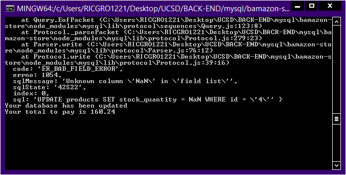

# bamazon-store
An Amazon-like storefront with MySQL. Customer view.

Running this application will first display all of the items available for sale. Include the id, name of product, price and quantity for sale.

## The app should then prompt users with two messages.

###### The first should ask them the ID of the product they would like to buy.


###### The second message should ask how many units of the product they would like to buy.
Once the customer has placed the order, your application should check if your store has enough of the product to meet the customer's request.
If not, the app should log a phrase like Insufficient quantity!, and then prevent the order from going through.


However, if your store does have enough of the product, you should fulfill the customer's order.
This means updating the SQL database to reflect the remaining quantity.



Once the update goes through, show the customer the total cost of their purchase.


```
const mysql = require("mysql");
const inquirer = require("inquirer");
const cliTable = require("cli-table");


const connection = mysql.createConnection({
    host: "localhost",
    port: 3307,
    user: "root",
    password: "",
    database: "bamazon_db"
});

connection.connect(function(err) {
    if (err) { console.log(err) };
    //Run function here!!....
    displayItems(connection);

});


function displayItems() {
    let query = "SELECT * FROM products";
    connection.query(query, function(err, res) {
        if (err) { console.log(err) };
        let stock = res[0].stock_quantity;
        console.log(res);
        customerPick(stock);
    });
};


function customerPick(stock) {
    inquirer
        .prompt({
            message: "What is the id number of the product to purchase?",
            name: "itemToBuy",
            type: "input"
        }).then(function(answer) {
            //insert function here...
            let itemId = answer.itemToBuy;
            console.log(`This is the product id you chose ${itemId}.\n`);
            checkQuantity(itemId, stock);
        });
};


function checkQuantity(item, stock) {
    // console.log('item passed in ', item);
    inquirer
        .prompt({
            message: "How many item would you like to buy?",
            name: "quantityToBuy",
            type: "input"
        }).then(function(answer) {
                let itemQuantity = answer.quantityToBuy;
                var query = `SELECT stock_quantity FROM products WHERE id = ${item}`;
                connection.query(query, function(err, res) {
                        if (err) { console.log(err) };
                        // console.log(res);
                        // console.log('itemQuantity', itemQuantity, 'res ', res[0].stock_quantity);
                        if (itemQuantity > res[0].stock_quantity) {
                            console.log('We do not have enough items in stock.\n Please select new quantity.')
                            checkQuantity(item);
                        } else {
                            // insert Function to dispay total of the item and update item_quantity...
                            // updateQuantity(itemQuantity, item);
                            updateQuantity(item, stock, itemQuantity);
                        }
                    })
        });
};


function updateQuantity(objectToUpdate, quantityToUpdate, quantitypurchased) {
	// console.log(quantityToUpdate);
	// console.log(objectToUpdate);
	quantityToUpdate = quantityToUpdate - quantitypurchased;
    var query = 'UPDATE products SET stock_quantity = ? WHERE id = ?';
    connection.query(query, [quantityToUpdate, objectToUpdate], function(err, res) {
            if (err) { console.log(err) };
            console.log(`Your database has been updated`);
            displayTotal(objectToUpdate, quantitypurchased);
        });
    };

function displayTotal(itemId, totalItems) {
	var query = 'SELECT price FROM products WHERE id = ?';
	connection.query(query, itemId, function(err, res) {
		if(err) {console.log(err)};
		let price = res[0].price;
		calculateTotal(price, totalItems);
		// console.log(`Your total to pay is ${res[0].price}`);
	});
};

function calculateTotal(price, quantity) {
	let total = price * quantity;
	console.log(`Your total to pay is ${total}`);
};

```
